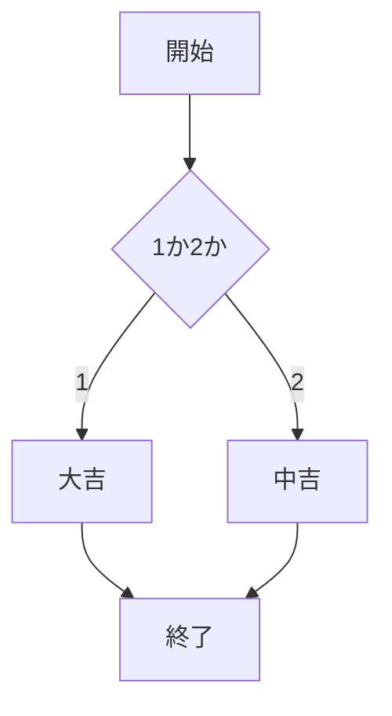
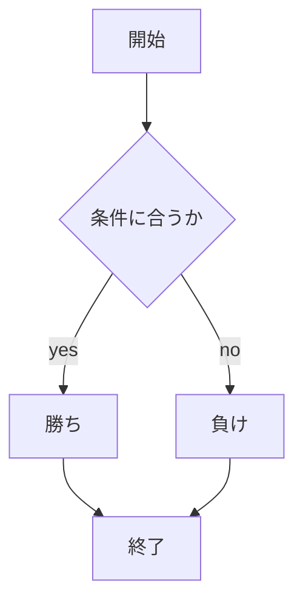

# webpro_06

## このプログラムについて

## ファイル一覧
ファイル名|説明|ejsファイル名|説明
-|-|-|-
app5.js|プログラム本体|-|-
public/hello1.html|メッセージを表示する画面|-|-
public/hello2.html|メッセージを表示する画面|-|-
public/icon.html|指定したアイコンを表示する画面|views/icon.ejs|アイコンを表示するテンプレファイル
public/luck.html|おみくじの開始画面|views/luck.ejs|おみくじのテンプレファイル
public/janken.html|じゃんけんの開始画面|views/janken.ejs|じゃんけんのテンプレファイル
public/takara.html|宝くじの開始画面|views/takara.ejs|宝くじのテンプレファイル
public/hantyo.html|半か丁の開始画面|views/hantyo.ejs|半か丁かのテンプレファイル

```python
console.log('Hello');
```

## 仕様
###### hello1
1. node app5.jsでapp5.jsを起動する
1. Webブラウザでlocalhost:8080/public/hello1.htmlにアクセスする

表示されるメッセージが
```python
const massage
```
で固定されており，
```python
 res.render('show', { greet1:message1, greet2:message2});
```
で出力するために呼び出されている
###### hello2
1. node app5.jsでapp5.jsを起動する
1. Webブラウザでlocalhost:8080/public/hello2.htmlにアクセスする

表示されるメッセージが
```python
res.render('show', { greet1:"Hello world", greet2:"Bon jour"});
```
で呼び出されている
###### icon
1. node app5.jsでapp5.jsを起動する
1. Webブラウザでlocalhost:8080/public/icon.htmlにアクセスする

以下のプログラムで表示したいアイコンのファイルがある場所を指定している
```python
res.render('icon', { filename:"./public/Apple_logo_black.svg", alt:"Apple Logo"});
```
また，icon.ejsの
```
" alt="<%= alt %>">
```
で'filename'に表示したいファイルを格納している

###### luck
1. node app5.jsでapp5.jsを起動する
1. Webブラウザでlocalhost:8080/public/luck.htmlにアクセスする
1. 画面上に今回の運勢が表示される
はじめにランダムな1か2の数字を取得し，それに伴い大吉か中吉かが判断される
```python
const num = Math.floor( Math.random() * 2 + 1 );
  let luck = '';
  if( num==1 ) luck = '大吉';
  else if( num==2 ) luck = '中吉';
```

###### 　janken
1. node app5.jsでapp5.jsを起動する 
1. Webブラウザでlocalhost:8080/public/janken.htmlにアクセスする
1. 自分の出す手を入力する

勝った数と勝負した数を0で最初に定義する
```python
let win = Number( req.query.win )||0;
let total = Number( req.query.total )||0;
```
1~3までのランダムな数を取得し，1の場合cpuはグーを示し2の場合cpuはチョキを表す．そしてされ以外の場合パーを表す．
```python
const num = Math.floor( Math.random() * 3 + 1 );
let cpu = '';
if( num==1 ) cpu = 'グー';
else if( num==2 ) cpu = 'チョキ';
else cpu = 'パー';
```


###### takara
1. node app5.jsでapp5.jsを起動する
1. Webブラウザでlocalhost:8080/public/takara.htmlにアクセスする
1. 1~100までの数字から任意の数字を半角英数字で入力する

1~100までの数字をランダムで取得し，その数をそのままCPUの数字として扱う．
```python
const num = Math.floor( Math.random() * 100 + 1 );
let cpu = '';
cpu = num;
```
CPUの数字とユーザーが入力した数字の絶対値の差が0のとき，3のとき5のときでそれぞれ大当たり，あたり，ニアピンとし，さらにそれ以外の場合にハズレと表示する．
```python
if (number == cpu){
    judgement = '一等，大当たりです';
  }else if (cpu - 3 >= number <= cpu +3) {
    judgement = '二等，あたりです';
    attempt += 1;
  }else if (cpu -5 >= number <= cpu +5) {
    judgement = '三等，ニアピン賞';
    attempt += 1;
  }else {
    judgement = '外れです';
  }
```
###### hantyo